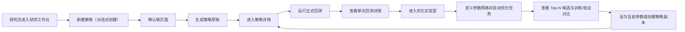
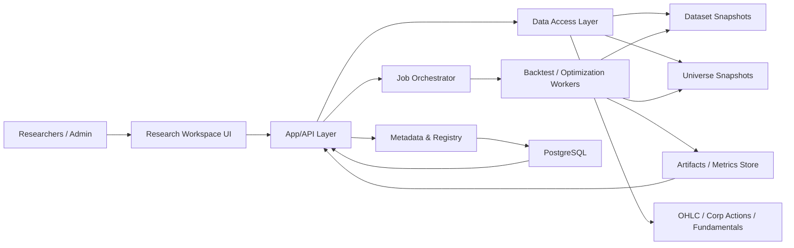

# V1 技术方案：公司级投资策略研究、回测与调优平台

Generated on 2026-03-24  
Status: DRAFT  
Scope: V1 implementation baseline

## 1. 目标与范围

### 1.1 产品目标

构建一套面向内部量化团队的 V1 平台，支持：

- 通过自然语言和结构化参数创建策略
- 在受控股票池与 ETF 池上做日频历史回测
- 对策略做参数网格优化，快速筛出候选参数
- 对每一轮回测和调优试验做可复现、可追溯的登记与检索
- 通过一致的数据快照和股票池快照保证点时正确性

V1 的重点是“研究、回测、调优”闭环，不包含测试盘、PM 审批台和实盘联调。

### 1.2 V1 明确范围

- 市场：仅美股
- 频率：仅日频
- 历史数据：OHLC 为默认行情字段
- 第一等公民资产：
  - 股票：历史近 30 年每月末的 `S&P 500 ∪ Nasdaq 100` 成分股并集
  - ETF：每月末点时市值大于 10 亿美元的主流 ETF
- 策略类型：
  - 资产配置
  - 股票多因子
- 组织形态：内部约 10 人
- 权限形态：单账户多角色
- 优化方式：参数网格批量回测
- 执行语义：`T 日信号 / T+1 开盘成交`

### 1.3 明确不在 V1 范围内

- PM 审批台
- 测试盘 / paper trading
- 偏差报告
- Sterling / TradeGPT 联调执行链
- 分钟级与 Tick 级回测
- 贝叶斯优化、遗传优化
- 自由公式排序的优化目标 DSL
- 手机端完整研究工作流

## 2. 设计原则

### 2.1 工程原则

- Boring by default：优先选择成熟、可解释、可运维的技术方案
- Point-in-time first：股票池、ETF 资格、快照、执行语义都以点时正确性优先
- Research truth over UI convenience：研究可信度优先于“快出结果”
- Trial vs Formal separation：优化试验结果与正式回测结果分离治理
- Explicit over implicit：规则、默认值、系统推断都必须向用户显式展示

### 2.2 产品原则

- 研究工作台优先，不做通用后台首页
- 策略少、运行多，因此“回测运行”是一级页面
- 优化实验室与正式回测分开，避免试验噪音淹没正式结果
- 新建策略走“对话式创建”，但必须提供结构化实时摘要与最终确认稿

## 3. 用户角色与核心工作流

### 3.1 V1 角色

- 量化研究员：
  - 创建策略
  - 跑正式回测
  - 运行参数优化
  - 查看结果并迭代
- 平台管理员：
  - 管理数据快照
  - 管理股票池 / ETF 资格快照
  - 管理任务运行与失败恢复
- 投资经理 / PM：
  - V1 中不承载独立 UI 流程
  - 第二期接入审批台

### 3.2 核心用户旅程

## 4. 总体架构

### 4.1 分层架构

### 4.2 逻辑组件

1. `Research Workspace UI`
- 研究工作台首页
- 我的策略
- 策略详情
- 回测运行
- 单次回测详情
- 优化实验室
- 数据快照
- 新建策略（对话式）
- 创建前确认稿

2. `App/API Layer`
- 身份与角色
- 策略 CRUD
- 对话式创建编排
- 回测任务提交
- 优化任
